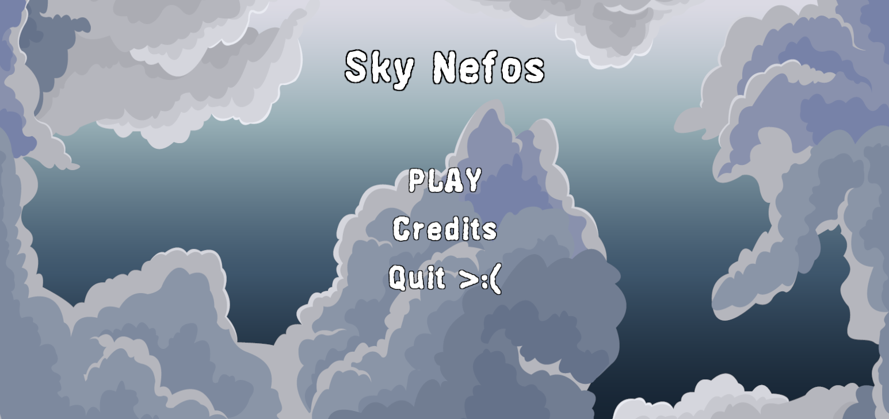
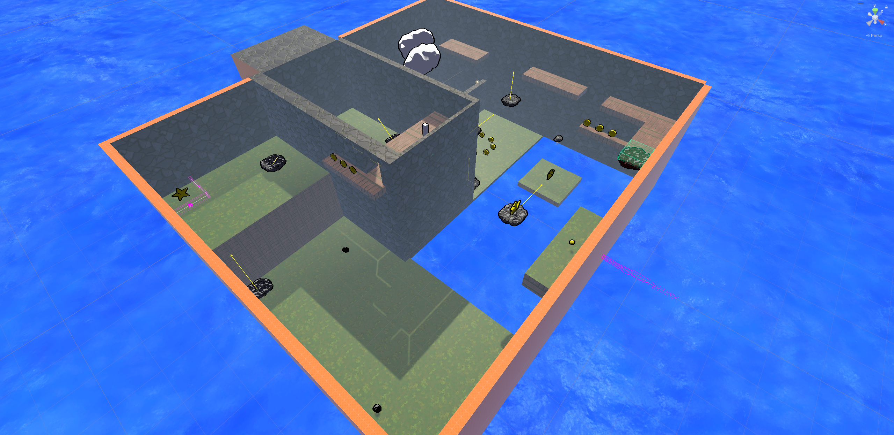
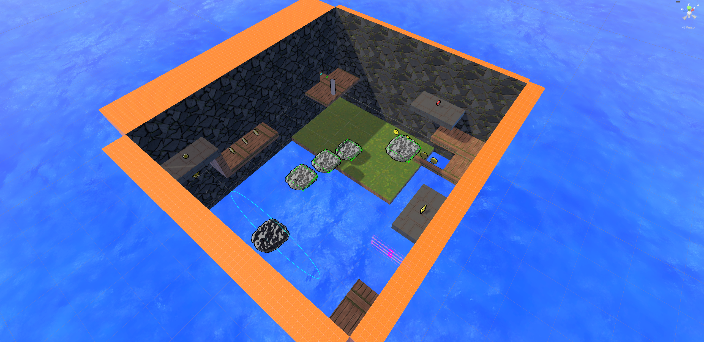
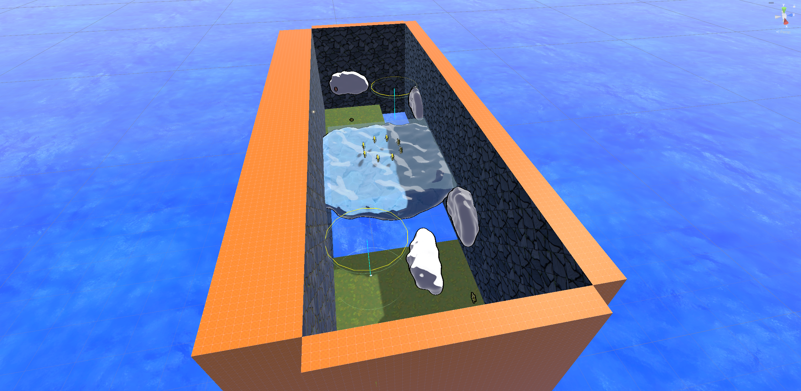
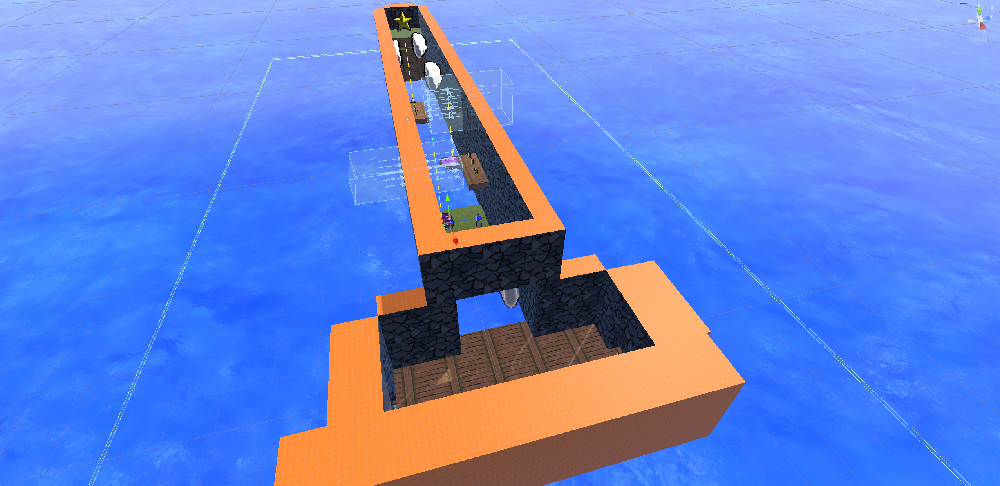
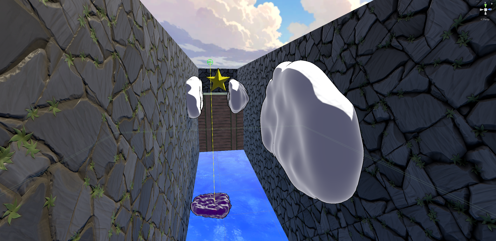

# 3D Platformer — SkyNefos

A fully playable 3D platformer built in Unity as part of the EPL426 (Computer Graphics) course at the University of Cyprus.

---

## About

This project was developed as coursework for EPL426 by a team of 2. The game is a cel-shaded 3D platformer where the player traverses a series of connected areas, unlocking movement abilities along the way. Starting with basic movement, players acquire a double jump, a dash, and a wall jump across dedicated tutorial rooms before reaching the main gameplay area. The project emphasizes both technical correctness — stable physics, smooth game feel, persistent state across scenes — and visual cohesion through a custom toon shader with outlined rendering.

---

## Features

### Player Movement
- Camera-relative ground movement with configurable acceleration and deceleration
- Reduced air control (60% of ground acceleration) for natural feel
- Variable-height jump: releasing early cuts height via a higher gravity multiplier
- **Coyote time** (0.12 s) — jump grace period after walking off a ledge
- **Jump buffering** (0.12 s) — queues a jump input just before landing
- Platform velocity inheritance for seamless movement on moving platforms

### Unlockable Abilities
- **Double Jump** — one extra air jump, reset on landing or wall contact
- **Dash** — 0.18 s burst at 16 m/s with a 0.6 s cooldown, directional or forward
- **Wall Jump** — 4-direction raycast detection; pushes horizontally (8 m/s) + upward (9 m/s); one jump per unique wall contact ("Mario Rule") prevents infinite climbing

### Platforms & Hazards
- **Moving platforms** — linear and circular paths with player tracking
- **Disappearing platforms** — blink warning before vanishing
- **Trampoline platforms** — compression animation and launch with cooldown
- **Ice platforms** — up to 90% reduced deceleration for slippery movement
- **Speed boost zones** — temporary speed multiplier volumes
- **Air current volumes** — directional wind push forces
- **Gravity flip volumes** — reverses gravity and rotates the player 180°
- **Thunder clouds** — warning state followed by branching lightning strikes
- **Lightning walls and beams** — static electric barriers
- **Tornado vortex** — cone-constrained upward pull
- **Hailstorm zones** — area damage volumes

### Enemies & Collectibles
- **Hail Shooter** — stationary enemy; defeated by stomping
- **Collectibles** — stars, health shards (4 per heart upgrade), and per-biome coins
- Collectibles persist across scene reloads via a GUID-based registry

### Game Systems
- **Checkpoints & respawn** — full heal on respawn, scene reload with fade
- **Scene transitions** — black fade in/out, named spawn points, 0.35 s post-load control lock
- **Pause system** — Time.timeScale pause with input isolation
- **Health system** — heart-based with invincibility frames, knockback, and blinking feedback
- **HUD** — heart display, health shards, death counter, star counter, per-biome coin counters
- **Audio** — singleton AudioManager with a 10-source SFX pool, 3D positional audio, and per-scene music controller
- **Persistent state** — player stats, camera rig, and audio manager survive scene loads via DontDestroyOnLoad

### Custom Toon Shader
- Cel shading with configurable shadow threshold and softness
- Hard-edged highlights and Fresnel-based rim lighting
- Screen-space outline (normal, position, or UV2 modes)
- Shader variants: standard, no-outline, outline-only, transparent, and unlit

---

## Tech Stack

| Tool / Library | Role |
|---|---|
| Unity 2023 | Game engine |
| C# | Scripting language |
| Unity CharacterController | Physics — chosen over Rigidbody for platformer precision |
| Cinemachine 2.10.5 | Camera system (FreeLook / VirtualCamera) |
| Unity Input System 1.14.2 | Modern input handling |
| TextMeshPro 3.0.7 | UI text rendering |
| ShaderGraph 14.0.12 | Shader development |
| Custom HLSL / ShaderLab | Toon shader with multi-pass rendering |
| Realtime CSG (plugin) | Constructive solid geometry for level building |

---

## Project Structure

```
Assets/
├── Scripts/
│   ├── Player/          # Motor, input reader, animator, ability pickup
│   ├── Platforms/       # Moving, disappearing, trampoline, ice, circular
│   ├── Hazards/         # Thunder cloud, lightning wall, tornado, hailstorm
│   ├── Enemies/         # Hail shooter, stomp detector
│   ├── Collectibles/    # Collectible logic, motion, type enum
│   ├── Damage/          # Health controller, damage-on-touch, damage source
│   ├── Audio/           # AudioManager, player/collectible/hazard audio
│   ├── UI/              # HUD controller, hearts UI, pause menu, main menu
│   ├── Transitions/     # Scene transition manager, spawn points, door portals
│   ├── Systems/         # PlayerStats, CollectedItemsRegistry, Bootstrapper
│   └── Editor/          # Custom editor tools (shader applier, prefab tools)
├── Scenes/
│   ├── MainMenu.unity
│   ├── StartingArea.unity
│   ├── DoubleJumpUnlockArea.unity
│   ├── WallJumpUnlockRoom.unity
│   ├── MainArea.unity
│   └── Sandbox_Playtest.unity
├── Shaders/             # ToonShader and variants
├── Materials/           # Player, platform, environment materials
├── Audio/               # SFX and background music
├── Art/                 # Sprites, models, VFX
└── Input/               # InputActionAsset configuration
```

**Key scripts at a glance:**

| Script | Responsibility |
|---|---|
| `PlayerMotorCC` | All movement: gravity, velocity, coyote time, ability flags, platform tracking |
| `PlayerInputReader` | Frame-accurate input state (pressed-this-frame booleans) |
| `PlayerAnimator` | Animation state machine — idle, run, jump, fall, land, dash, wall slide |
| `PlayerStats` | Persistent singleton: health, stars, coins, deaths, ability unlocks |
| `AudioManager` | Singleton with SFX source pool and 3D positional audio |
| `SceneTransitionManager` | Fade-in/out scene loads with named spawn point targeting |
| `RespawnManager` | Checkpoint save/restore, teleport, full heal |
| `CollectedItemsRegistry` | GUID-based collectible persistence across scene reloads |
| `Bootstrapper` | Instantiates all persistent prefabs on startup |

---

## How to Run

1. Clone or download the repository.
2. Open Unity Hub and click **Open Project**, then select the repository root.
3. Make sure the Unity version matches (2023.x recommended — check `ProjectSettings/ProjectVersion.txt`).
4. Once the project loads, open `Assets/Scenes/MainMenu.unity`.
5. Press **Play** in the Unity Editor.

To build a standalone executable:
- Go to **File → Build Settings**, select your target platform, and click **Build and Run**.
- Ensure all scenes are added to the build list in the order listed under [Project Structure](#project-structure).

---

## What I Learned

Building this project gave me hands-on experience with the full pipeline of real-time 3D graphics and game systems engineering.

On the **graphics side**, writing the custom toon shader deepened my understanding of the render pipeline — working with multiple shader passes for the outline effect, using smoothstep for cel-shading thresholds, and implementing Fresnel-based rim lighting. I learned how screen-space outlines work (inverting face culling on a scaled pass), and why shader variants are necessary to handle edge cases like transparent surfaces or unlit materials without branching inside a single shader.

On the **systems side**, building stable platformer movement taught me how much work goes into "game feel." Coyote time and jump buffering are invisible to players but critical to responsiveness — getting them right required understanding the gap between physics frames and the player's perceived input window. Using `CharacterController` instead of `Rigidbody` forced me to implement my own gravity, ground detection, and platform velocity inheritance from scratch, which gave me a much clearer picture of how physics-based movement actually works underneath engine abstractions.

Designing the **persistence architecture** — singletons that survive scene loads, a GUID registry for collectibles, event-driven UI updates — showed me how quickly shared state becomes a problem as a project grows, and reinforced why decoupling systems through events (rather than direct references) makes scenes easier to maintain and extend.

Finally, working in a two-person team on a shared Unity project exposed me to the real challenges of collaborative game development: merge conflicts on scene files, coordinating prefab changes, and agreeing on naming conventions and layer assignments early enough to avoid painful refactors later.

---

## Screenshots

> Add screenshots here by replacing the placeholders below.
> Recommended: one image per section (main menu, starting area, ability unlock room, main area, HUD, toon shader close-up).








To capture screenshots in the Unity Editor, use **Window → General → Game View** at your target resolution, then take a screenshot with your OS tool or use Unity's `ScreenCapture.CaptureScreenshot()` in a quick editor script.

---

## Team

- Loizos Foukkaris
- Andreas Protopapas

University of Cyprus — EPL426 Computer Graphics
